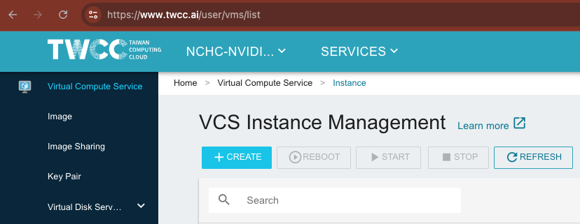
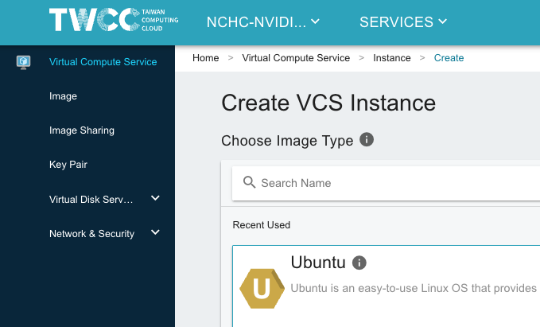
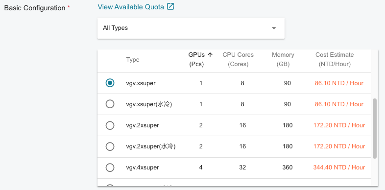
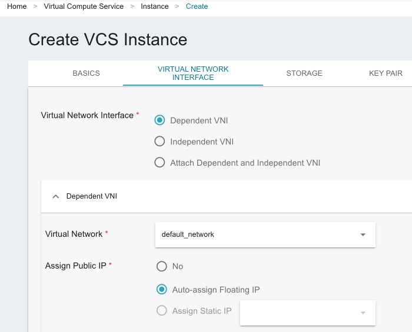
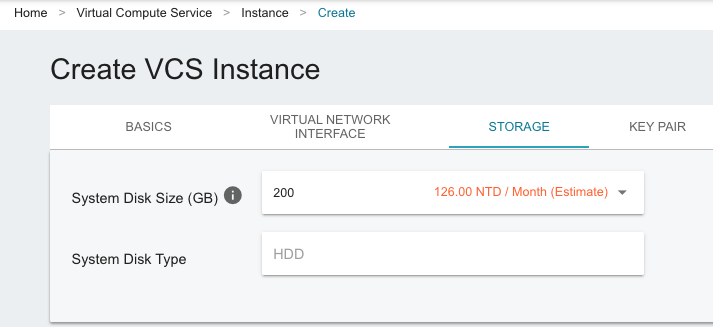
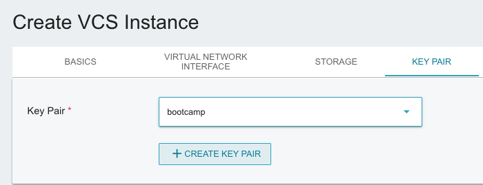
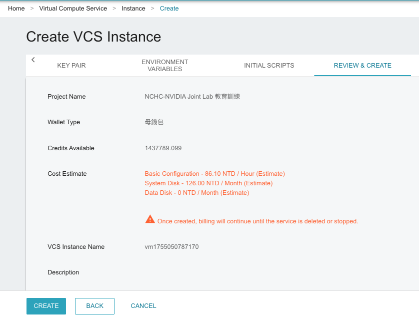
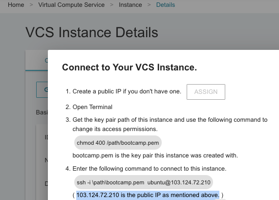
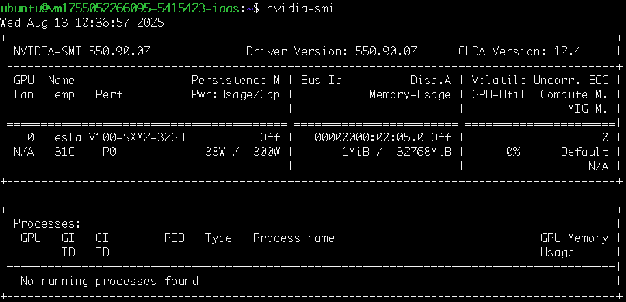
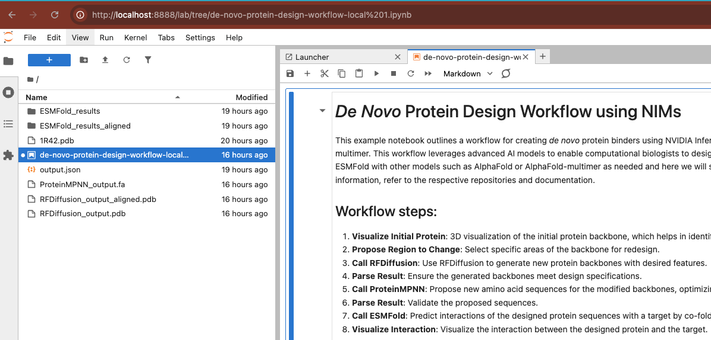

# NCHC VCS - NVIDIA NIMS SETUP GUIDE

Will run 3 docker contgainers to server 2 NIMs and 1 JupyterLab for this bootcamp:
- NIMS
    - [rfdiffusion](https://build.nvidia.com/ipd/rfdiffusion)
    - [proteinmpnn](https://build.nvidia.com/ipd/proteinmpnn)
    - see more NIMs in [documentation](https://docs.nvidia.com/nim/index.html#bionemo); 
- JupyterLab
    - [bionemo framework](https://github.com/NVIDIA/bionemo-framework)
    - see more BioNeMo in [documentation](https://docs.nvidia.com/bionemo-framework/latest/).

## Prerequisites - TWCC VCS Setup

### Setup VM
- Login [TWCC VCS](https://www.twcc.ai/user/vms/list)
- Click "Create"
- Choose image type "Ubuntu"
- Select the image "(private)bionemo20250904", we pre-built the image for the bootcamp, you could build your own by following [#How to create your own bootcamp-ready VM image](#how-to-create-your-own-bootcamp-ready-vm-image)
- Configure the single GPU Type "vgv.xsuper".
- In "VIRTUAL NETWORK INTERFACE", "Assign Public IP", choose "Auto-assign Floating IP"
- In "STORAGE", make sure "System Disk Size (GB)" with at least "200".
- In "KEY PAIR", click "+CREATE KEY PAIR" to create your own. Note that we had disabled key pair in this pre-built VM image for simplicity.
- All config are ready, please click "REVIEW & CREATE" then "CREATE" to launch the VM.
- Wait a few minutes to see instance's state show "Ready".
- In "VCS Instance Detail", click "CONNECT" to find out the "public IP".
- Use a terminal to ```ssh``` your VM instance with the "public IP". An Example: ```ssh ubuntu@103.124.72.210```. (You will be asked to reset password first time)
- Use ```nvidia-smi``` to check if the GPU driver is ready.
- Wonderful, now the VM is ready, next, we will launch 3 docker containers for our bootcamp.

### Have the Free Developer API Key Ready

- Access to [https://build.nvidia.com/explore/biology](https://build.nvidia.com/explore/biology), and create a free developer account if you don't have one yet.
- Click the upper-right user account and select "API Keys".
- Go "Generate API Key" to create your own developer API KEY, please "COPY API Key" for the NIMs used in bootcamp.
- Back to terminal, then ```vim ~/.bashrc``` to replace the "BOOTCAMP_KEY" with your granted "API Key"
or you could just skip this step and use the default "BOOTCAMP_KEY", note that is will be expired after the bootcamp.
- use ```source ~/.bashrc``` to activate your environment variable "BOOTCAMP_KEY".

### Setup bootcamp containers 

(2 NIMs + 1 JupyterLab)
- `port 8002` for `rfdiffusion` NIM
- `port 8003` for `proteinmpnn` NIM
- `port 8888` for Jupyter Lab with `bionemo` container

```bash
## launch rfdiffusion on port 8002
docker run -d --rm \
    --runtime=nvidia \
    --gpus='"device=0"' \
    -p 8002:8000 \
    -e NGC_API_KEY \
    -v "$LOCAL_NIM_CACHE":/opt/nim/.cache \
    nvcr.io/nim/ipd/rfdiffusion:2.1
## launch proteinmpnn on port 8003
docker run -d --rm \
    --runtime=nvidia \
    --gpus='"device=0"' \
    -p 8003:8000 \
    -e NGC_CLI_API_KEY \
    -v "$LOCAL_NIM_CACHE":/home/nvs/.cache/nim \
    nvcr.io/nim/ipd/proteinmpnn:1.0
## launch bionemo conatiner and jupyter lab
docker run -d --rm \
    --gpus all --network host \
    -e NGC_CLI_API_KEY \
    -e NVIDIA_API_KEY \
    -v $PWD:$PWD \
    nvcr.io/nvidia/clara/bionemo-framework:2.6.3 \
    bash -c "cd /home/ubuntu; jupyter lab --allow-root \
    --ip=0.0.0.0 --port=8888 \
    --no-browser --NotebookApp.token='' \
    --NotebookApp.allow_origin='*' \
    --ContentsManager.allow_hidden=True"
```

Use `docker ps` to view running containers. You should see output similar to the following:

```bash
docker ps
```

An example:
```
#CONTAINER ID   IMAGE                                        COMMAND                   CREATED          STATUS          PORTS                                         NAMES
#baa6ae96777e   nvcr.io/nvidia/clara/bionemo-framework:2.1   "/opt/nvidia/nvidia_…"    6 seconds ago    Up 2 seconds                                                  hopeful_murdock
#ba1723a2d962   nvcr.io/nim/ipd/proteinmpnn:1.0.0            "/opt/nvidia/nvidia_…"    10 seconds ago   Up 8 seconds    0.0.0.0:8003->8000/tcp, [::]:8003->8000/tcp   brave_ptolemy
#b4ad6b6858e6   nvcr.io/nim/ipd/rfdiffusion:2                "/bin/sh -c 'exec \"$…"   18 seconds ago   Up 16 seconds   0.0.0.0:8002->8000/tcp, :::8002->8000/tcp     practical_elbakyan
```

Wait a few minutes for launching NIMs service, and then use `curl` to check API health status:

```bash
# check rfdiffusion
curl http://localhost:8002/v1/health/ready
# check proteinmpnn
curl http://localhost:8003/v1/health/ready
```

An example:

```
#{"status":"ready"}
#{"status":"ready"}
```

### Develop on your own client device.

setup ssh tunneling, port forwarding jupyter lab to localhost. use below command on client terminal. 
``` 
ssh -fNL 8888:localhost:8888 ubuntu@<YOUR VM PUBLIC IP>
```

Then open your browser: http://localhost:8888, and find notebook "de-novo-protein-design-workflow-local 1.ipynb".

### Reference

- [rfdiffusion doc](https://docs.nvidia.com/nim/bionemo/rfdiffusion/latest/quickstart-guide.html)
- [proteinmpnn doc](https://docs.nvidia.com/nim/bionemo/proteinmpnn/latest/quickstart-guide.html)
- [NVIDIA BioNeMo Blueprint: Protein Binder Design](https://github.com/NVIDIA-BioNeMo-blueprints/generative-protein-binder-design)

## How to create your own bootcamp-ready VM image

### Create VCS Instance (Image Type: Ubuntu)

- `BASICS`
    - Image info = 
(public)Ubuntu-24.04-20250603
    - Basic Configuration = vgv.xsuper
- `VIRTUAL NETWORK INTERFACE`
    - Assign Public IP = Auto-asign Floating IP
- `KEY PAIR`
    - follow [doc](https://man.twcc.ai/@twccdocs/doc-vcs-main-zh/https%3A%2F%2Fman.twcc.ai%2F%40twccdocs%2Fguide-vcs-keypair-zh) to create one.
- `INITIAL SCRIPTS`
    - follow [doc](https://man.twcc.ai/@twccdocs/doc-vcs-main-zh/https%3A%2F%2Fman.twcc.ai%2F%40twccdocs%2Fhowto-vcs-gpu-driver-via-initial-scripts-zh) to install a NVIDIA GPU Driver.
- click on `CREATE`

see more VCS tutorials made by TWCC on [YouTube](https://www.youtube.com/watch?v=BNQ7npYQDSo&list=PLYcc4OEy5lEDzfHqN79Yu1KHXbRFVRtdX&index=1&ab_channel=%E5%9C%8B%E7%B6%B2%E4%B8%AD%E5%BF%83-iService).

### Remote Access VM and Setup Docker 

After your VM's state show `Active`, In `BASICS` tab, click `CONNECT` to have your VM public IP. Launch your local terminal, and ssh to the remote VM.

```bash
ssh -i <your ssh private key> ubuntu@<YOUR VM PUBLIC IP>
```

if GPU driver not ready, follow [Installation Guide](https://man.twcc.ai/@twccdocs/doc-vcs-main-zh/https%3A%2F%2Fman.twcc.ai%2F%40twccdocs%2Fhowto-vcs-install-nvidia-gpu-driver-zh) to install NVIDIA GPU Driver. see example below:

```bash
echo "blacklist nouveau" | sudo tee /etc/modprobe.d/blacklist-nouveau.conf && echo "options nouveau modeset=0" | sudo tee -a /etc/modprobe.d/blacklist-nouveau.conf && sudo update-initramfs -u && sudo modprobe -r nouveau && sudo modprobe nouveau && sudo apt-get update && sudo apt-get install libc-dev -y && sudo apt-get install linux-headers-$(uname -r) -y && wget https://tw.download.nvidia.com/tesla/550.90.07/NVIDIA-Linux-x86_64-550.90.07.run && sudo sh NVIDIA-Linux-x86_64-550.90.07.run --accept-license --no-questions --dkms -s
```

follow [Installation Guide](https://docs.nvidia.com/ai-enterprise/deployment/vmware/latest/docker.html) to install Docker and NVIDIA Container Toolkit. see example below:

```bash
# install docker
curl -fsSL get.docker.com | bash
sudo groupadd docker
sudo usermod -aG docker $USER
newgrp docker
## verfiy docker is ready
docker run hello-world
# install NVIDIA Container Toolkit
curl -fsSL https://nvidia.github.io/libnvidia-container/gpgkey | sudo gpg --dearmor -o /usr/share/keyrings/nvidia-container-toolkit-keyring.gpg \
  && curl -s -L https://nvidia.github.io/libnvidia-container/stable/deb/nvidia-container-toolkit.list | \
    sed 's#deb https://#deb [signed-by=/usr/share/keyrings/nvidia-container-toolkit-keyring.gpg] https://#g' | \
    sudo tee /etc/apt/sources.list.d/nvidia-container-toolkit.list
sudo apt-get update
sudo apt-get install -y nvidia-container-toolkit
sudo nvidia-ctk runtime configure --runtime=docker
sudo systemctl restart docker
## verify docker with nvidia container toolkit
docker run --rm --runtime=nvidia --gpus all ubuntu nvidia-smi
```

### Setup NVIDIA NIM and BioNeMo Container

```bash
ssh -i <your ssh private key> ubuntu@<YOUR VM PUBLIC IP>
```

### Firstly, have Free Developer API Key Ready

- Access to [https://build.nvidia.com/explore/biology](https://build.nvidia.com/explore/biology), and create a free developer account if you don't have one yet.
- Click the upper-right user account and select "API Keys".
- Go "Generate API Key" to create your own developer API KEY, please "COPY API Key" for the NIMs used in bootcamp.

### Setup Keys

- [rfdiffusion doc](https://docs.nvidia.com/nim/bionemo/rfdiffusion/latest/quickstart-guide.html)
- [proteinmpnn doc](https://docs.nvidia.com/nim/bionemo/proteinmpnn/latest/quickstart-guide.html)

log in with your NGC API (enter the key as password when prompted.)

```bash
docker login nvcr.io --username='$oauthtoken'
```

It is recommended to add the following environment variables to your `~/.bashrc` file, enabling them to auto-load in every bash session.

```bash
vim ~/.bashrc
```

Make sure following KEYs are set within your `~/.bashrc` file.

```bash
## Env Variables
export BOOTCAMP_KEY=<YOUR OWN API Key>
export NGC_API_KEY=$BOOTCAMP_KEY
export NGC_CLI_API_KEY=$BOOTCAMP_KEY
export NVCF_RUN_KEY=$BOOTCAMP_KEY
export NVIDIA_API_KEY=$BOOTCAMP_KEY
export LOCAL_NIM_CACHE=~/.cache/nim
```

update env vars:

```bash
source ~/.bashrc
```

Skip this one if you already have the folder `$LOCAL_NIM_CACHE` ready:

```bash
if [ -d "$LOCAL_NIM_CACHE" ]; then
    echo "Folder exists: $LOCAL_NIM_CACHE"
else
    echo "Folder does not exist. Creating folder: $LOCAL_NIM_CACHE"
    mkdir -p "$LOCAL_NIM_CACHE"
    sudo chmod -R 0777 "$LOCAL_NIM_CACHE"
fi
```

### Build your own VM image (optional)

At this stage, it is recommended to create a VM image to avoid repeating the above steps in the future. Please refer to the [documentation](https://man.twcc.ai/@twccdocs/doc-vcs-main-zh/https%3A%2F%2Fman.twcc.ai%2F%40twccdocs%2Fhowto-vcs-resize-instance-zh) for guidance on creating your own VM image.

### Then following the section: [#Setup bootcamp containers](#setup-bootcamp-containers)

## FAQ

### How to stop containers?
 
In server side, use `docker stop <CONTAINER ID>` to stop one or `docker stop $(docker ps -aq)` to stop all.

```bash
docker stop $(docker ps -aq)
```